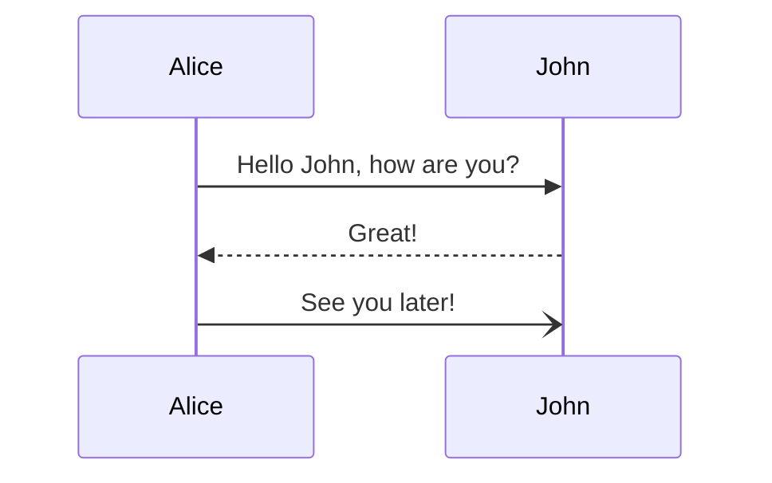

# فارسی

### From Reveal

- آیتم اول <!-- .element: class="fragment" data-fragment-index="1" -->
- آیتم دوم <!-- .element: class="fragment" data-fragment-index="2" -->

---

# Slide 2

<!-- .slide: data-background="#ff0000" -->
Markdown content

--

### Vertical

TODO

--

### Vertical

TODO

 ```js [1-2|3|]
    let a = 1;
let b = 2;
let c = x => 1 + 2 + x;
c(3);
```

asdas



---

# Slide 3

--

> Some stuff

---

### A Slide containing an image.

<section data-auto-animate>
  
  <div data-id="box" style="height: 4px; background: salmon;"></div>
</section>
<section data-auto-animate>
  <div data-id="box" style="height: 300px; display: flex; align-items: center; justify-content: center; background: blue;">
    The End
  </div>
</section>
